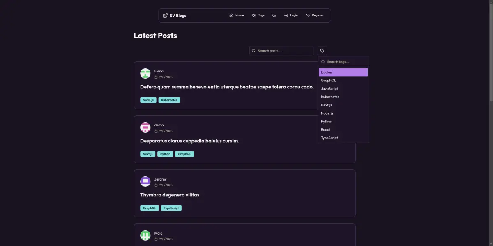

# SV Blogs


## 📋 Descripción
Una plataforma moderna de blogs construida con Next.js 15 y TypeScript. Diseñada para ofrecer una experiencia de blogging fluida y elegante con autenticación de usuarios, editor de contenido rico y diseño adaptable.

- **Propósito**: Crear una plataforma de blogs moderna y accesible
- **Características clave**: Autenticación con GitHub/Google, editor WYSIWYG, modo oscuro/claro
- **Público objetivo**: Desarrolladores y creadores de contenido técnico


## 📸 Imagenes del Proyecto



## ✨ Características Destacadas
- Autenticación social con GitHub y Google
- Editor de texto enriquecido con React Quill
- Temas claro/oscuro con next-themes
- UI moderna con shadcn/ui
- Base de datos PostgreSQL con Prisma
<!-- - Animaciones fluidas con Framer Motion -->

## 🛠️ Stack Tecnológico
| Frontend                | Backend        | Utilidades            |
|------------------------|----------------|----------------------|
| Next.js 15             | Prisma         | TypeScript           |
| React 19               | PostgreSQL     | ESLint/Prettier      |
| Tailwind CSS           | NextAuth.js    | Zod                 |
| shadcn/ui              | bcryptjs       | React Hook Form      |
|                        |                | slugify             |

## ⚙️ Instalación
1. Clona el repositorio:
```bash
git clone https://github.com/santiagoarielv98/sv-blogs.git
```

2. Instala dependencias:
```bash
npm install
```

3. Configura las variables de entorno:
Crea un archivo `.env` con:
- DATABASE_URL
- AUTH_SECRET
- AUTH_GITHUB_ID
- AUTH_GITHUB_SECRET
- GOOGLE_ID
- GOOGLE_SECRET

4. Ejecuta las migraciones de la base de datos:
```bash
npx prisma migrate dev
```

5. Ejecuta el script de seed:
```bash
npx prisma db seed
```

> **Nota**: Este comando ejecutará automáticamente un script de seed que creará datos de prueba y un usuario demo para desarrollo:
> - Email: demo@example.com
> - Password: password

5. Inicia el servidor de desarrollo:
```bash
npm run dev
```


## 🤝 Cómo Contribuir
1. Haz un Fork del proyecto
2. Crea tu Feature Branch (`git checkout -b feature/NuevaFuncionalidad`)
3. Commit tus cambios (`git commit -m 'Agrega NuevaFuncionalidad'`)
4. Push a la Branch (`git push origin feature/NuevaFuncionalidad`)
5. Abre un Pull Request

## 📬 Contacto
Santiago Ariel - [GitHub](https://github.com/santiagoarielv98)
Porfolio - [santiagoarielv98.vercel.app](https://santiagoarielv98.vercel.app/)

## 🙌 Agradecimientos
- [Next.js](https://nextjs.org)
- [shadcn/ui](https://ui.shadcn.com)
- [Prisma](https://www.prisma.io)
